# Documento de Requerimientos (PRD - Product Requirements Document)

## Alcance y Definición del MVP

### Objetivo del Proyecto
1. **Objetivo del Proyecto.**

    Crear un blog personal dinámico utilizando Python y Reflex que sirva como pieza central de un portafolio profesional. El sistema debe demostrar competencias en desarrollo Full-Stack, diseño de bases de datos y despliegue de aplicaciones.

2. **Definición del MVP (Producto Mínimo Viable)**

    Para la versión 1.0, nos centraremos en lo esencial para que el producto sea funcional y desplegable. Todo lo demás se moverá al "Backlog" para futuras versiones.

    **A. Funcionalidades "Core" (Must-Have).**

    Estas son obligatorias para lanzar:

    1. Vista Pública (Frontend):
    
        - Landing Page: Presentación breve (Hero section) + Listado de últimos artículos.

        - Blog Feed: Lista paginada de todos los artículos con filtrado simple (por categoría).

        - Post View: Página dinámica para leer un artículo individual. Debe renderizar Markdown a HTML (para código, negritas, listas, imágenes).

        - Sobre Mí: Página estática con tu CV resumido y enlaces a redes.

    2. Gestión de Contenido (Backend/Admin):

        Panel de Administración Básico protegido por contraseña:

        - Crear/Editar posts (Título, Slug, Contenido Markdown, Imagen de portada).

        - Publicar/Borrador (estado del post).

    **B. Funcionalidades "Nice-to-Have" (V2 - Backlog).**

    - Comentarios (requiere mucha moderación/auth).

    - Modo oscuro/claro (Reflex lo trae nativo, pero ajustar estilos personalizados toma tiempo).

    - Buscador avanzado (Full-text search).

    - Analytics propio.

3. **Decisión Técnica Crítica: Estrategia de Datos.**

    Database - "Blog Dinámico": Los posts se guardan en una base de datos (SQLite/Postgres).

4. **Historias de Usuario (User Stories).**
    
    - Como visitante, quiero ver una lista de artículos ordenados por fecha para leer el contenido más reciente.
    
    - Como visitante, quiero ver fragmentos de código con resaltado de sintaxis (syntax highlighting) dentro de los artículos para entender los ejemplos técnicos.

    - Como administrador, quiero poder escribir mis posts en formato Markdown y guardarlos en la base de datos para no depender de editar código fuente para publicar.

5. **Stack Tecnológico Definido**

    - Lenguaje: Python 3.10+

    - Framework Web: Reflex (Full stack).

    - ORM: SQLModel (Nativo en Reflex).

    - DB: SQLite (Desarrollo) / PostgreSQL (Producción).

    - Renderizado de Texto: Componente rx.markdown de Reflex.

    - Control de Versiones: Git + GitHub.

## **Diseño**
1. **Diseño de Base de Datos (Schema).**

    Como usamos Reflex, definiremos nuestros modelos usando SQLModel. Estas clases sirven tanto como tablas de base de datos como validadores de datos (gracias a Pydantic).
    
    Diagrama entidad-relación para un blog profesional:

    **Tablas Principales**
    - User: El administrador.

    - Post: Los artículos del blog.

    - Tag: Etiquetas para categorizar (Python, Tutorial, Reflex, etc.).

    - PostTagLink: Tabla intermedia para la relación "muchos a muchos" (un post tiene muchos tags, un tag tiene muchos posts).
    
        

2. **Mockups y Wireframes (UI con Componentes Reflex).**

    En lugar de dibujar píxeles, en Reflex pensamos en componentes, construiremos las 3 vistas clave usando los "primitivos" de Reflex:

    **A. Página de Inicio (Landing)**
    El objetivo es que sea limpia y rápida.
    
    - Contenedor Principal: rx.container (centrado, ancho máximo controlado).
    
    - Hero Section:
        - `rx.vstack` (pila vertical) con un `rx.heading` grande ("Hola, soy [Tu Nombre]") y un `rx.text` de biografía corta.

        - `rx.hstack` para iconos sociales (GitHub, LinkedIn) usando `rx.icon`.

    - Lista de Artículos (Grid):

        - Usaremos un `rx.grid` o `rx.flex` que sea responsive (1 columna en móvil, 3 en desktop).

    - Componente PostCard: Cada tarjeta será un `rx.card` que contiene:

        - `rx.image` (portada del post).

        - `rx.heading` (título).

        - `rx.badge` (para mostrar los Tags como etiquetas de colores).

        - `rx.text` (fecha de publicación).
    
    **B. Vista de Lectura (Post Detail)**

    Donde el usuario consume el contenido.

    - Navegación: Un `rx.breadcrumb` arriba para volver al inicio.

    - Cabecera del Post: `rx.heading` grande + `rx.avatar` del autor + fecha.

    - Cuerpo del Artículo:

        - Aquí usaremos el componente estrella: `rx.markdown`.

        - Este componente toma el texto de la base de datos y lo convierte mágicamente en HTML, renderizando encabezados, negritas y bloques de código automáticamente.

        - Pie de página: Una sección de "Leer siguiente" con `rx.link` a otros posts.
    
    **C. Dashboard de Admin (Privado)**

    Tu centro de control. No necesita ser bonito, sino funcional.

    - Sidebar: `rx.box` lateral con enlaces a "Posts", "Tags", "Configuración".

    - Tabla de Gestión:

        - Usaremos `rx.data_table` (componente nativo poderoso) para listar todos los posts.

        - Columnas: ID, Título, Estado (Publicado/Borrador), Acciones (Editar/Borrar).

    - Editor:

        - Un formulario con `rx.input` para el título.

        - Un `rx.text_area` grande para escribir el Markdown.

        - Un `rx.button` "Guardar" que dispare un evento de estado (`State.save_post`).

    D. **Wireframe Lógico (Árbol de Componentes)**

    Antes de escribir código, visualizamos la jerarquía. Esto es lo que el motor de Reflex renderizará en el DOM.

    ```text
    graph TD

    Page[Page: post_detail] --> Cont[rx.container: size='3']
    Cont --> Stack[rx.vstack: Main Layout]
    
    %% Navegación
    Stack --> Bread[rx.breadcrumb.root]
    Bread --> BreadItems[Items: Inicio > Blog > Post]
    
    %% Cabecera del Post
    Stack --> Header[Header Section: rx.vstack]
    Header --> Title[rx.heading: H1 Grande]
    Header --> Meta[rx.hstack: Meta Info]
    Meta --> Av[rx.avatar: Autor]
    Meta --> MetaInfo[rx.vstack: Info Vertical]
    MetaInfo --> AuthorName[rx.text: Nombre (Bold)]
    MetaInfo --> DateRead[rx.text: Fecha + Min Lectura]
    
    %% Cuerpo del Artículo
    Stack --> BodyWrapper[rx.box: class='prose']
    BodyWrapper --> MD[rx.markdown: Contenido Renderizado]
    
    %% Separador
    Stack --> Divider[rx.divider]
    
    %% Pie de Página (Leer Siguiente)
    Stack --> Footer[Footer Section: rx.vstack]
    Footer --> NextTitle[rx.heading: 'Leer siguiente']
    
    Footer --> LinkWrapper[rx.link: href='/post/...']
    LinkWrapper --> NextCard[rx.card: variant='ghost']
    NextCard --> CardContent[rx.hstack]
    CardContent --> Icon[rx.icon: arrow_right]
    CardContent --> PostText[rx.text: Título del Post]

    end
    ```
    E. **Mockup Visual (Representación de Diseño)**
    
    Vista de Escritorio (Desktop)
    ```text
    +---------------------------------------------------------------+
    |                      [ rx.container ]                         |
    |                                                               |
    |                  [ rx.avatar (Círculo) ]                      |
    |           [ rx.heading: Hola, soy ... ]            |
    |       [ rx.text: Ingeniero TI & Dev Full-Stack... ]           |
    |          [ (O) GitHub ]   [ (in) LinkedIn ]   [ (X) ]         |
    |                                                               |
    | -------------------- rx.divider ----------------------------- |
    |                                                               |
    |  [ rx.heading: Últimas Publicaciones ]                        |
    |                                                               |
    |  [ rx.grid (columns=3) ]                                      |
    |                                                               |
    |  +--------------+    +--------------+    +--------------+     |
    |  | [ rx.image ] |    | [ rx.image ] |    | [ rx.image ] |     |
    |  | (inset/cover)|    | (inset/cover)|    | (inset/cover)|     |
    |  |              |    |              |    |              |     |
    |  | [ Heading  ] |    | [ Heading  ] |    | [ Heading  ] |     |
    |  | [Bdg] [Bdg]  |    | [Bdg] [Bdg]  |    | [Bdg] [Bdg]  |     |
    |  | [ Date     ] |    | [ Date     ] |    | [ Date     ] |     |
    |  +--------------+    +--------------+    +--------------+     |
    |                                                               |
    +---------------------------------------------------------------+
    ```
    Vista Móvil (Mobile)
    ```
    +----------------------+
    |   [ rx.container ]   |
    |                      |
    |      ( Avatar )      |
    |    [ Hola... ]       |
    |    [ Bio... ]        |
    |  [ (O) ] [ (in) ]    |
    |                      |
    | --- rx.divider ----  |
    |                      |
    | [ Últimas Pubs... ]  |
    |                      |
    | [ rx.grid (col=1) ]  |
    |                      |
    |  +--------------+    |
    |  | [ rx.image ] |    |
    |  |              |    |
    |  | [ Heading  ] |    |
    |  | [Bdg] [Bdg]  |    |
    |  | [ Date     ] |    |
    |  +--------------+    |
    |                      |
    |  +--------------+    |
    |  | [ rx.image ] |    |
    |  | ...          |    |
    |  +--------------+    |
    +----------------------+
    ```

    E. **Descripción de los Directorios Clave.**

    - `assets/`: Aquí van tus archivos estáticos. Todo lo que pongas aquí será accesible públicamente.

    - `blog/components/`: Si un elemento se usa en más de una página (como el menú o el footer), va aquí. Esto mantiene las páginas limpias.

    - `blog/models/`: Aquí vivirán las `clases User` y `Post`. Es la capa de datos pura.

    - `blog/pages/`: Cada archivo aquí representa una URL del sitio (ej. miweb.com/dashboard). Aquí ensamblas los componentes.

    - `blog/state/`: El cerebro de la aplicación. Aquí van las funciones Python (`def save_post(...)`, `def load_posts(...)`). Reflex separa la UI (`pages`) de la lógica (`state`).

## **Desarrollo**

**Configuración de la Base de Datos (Modelos)**

Definimos la estructura de los datos. Reflex usa SQLModel bajo la capa, lo que nos permite definir tablas como clases de Python.

Archivo: `blog/models/post.py`
```python
import reflex as rx
from datetime import datetime
from sqlmodel import Field, Relationship
from typing import List, Optional
```

reflex: Framework para crear aplicaciones web full-stack en Python

datetime: Para manejar fechas y horas

SQLModel: ORM que combina Pydantic y SQLAlchemy

typing: Para tipado estático (List, Optional)


